# Assembly

## Parts List

### Electronics
- **1x** Waveshare Serial Bus Servo Driver Board  
  [Amazon](https://www.amazon.fr/dp/B0CJ6TP3TP)

- **3x** Waveshare 20kg.cm Bus Servo Motors (includes mounting screws)
  [Amazon](https://www.amazon.fr/dp/B0CDC587BQ)

- **1x** 60W 12V 5A Power Supply  
  [Amazon](https://www.amazon.fr/dp/B001W3UYLY)

- **1x** USB-C to USB-C cable (for servo driver board)
- **1x** USB Micro to USB-C cable (for camera)

- **1x** Synchronous 3D Stereo USB Camera (3840×1080P, 4MP, 60fps, 130° FOV)  
  [AliExpress](https://www.aliexpress.com/item/1005006353765708.html)

> **Note:** If using a different camera, you may need to adapt the 3D printed parts and object detection model accordingly.


### Hardware
- **2x** M2×3×3 Heat Set Inserts  
  [Amazon](https://www.amazon.fr/dp/B0CS6XJSSL)

- **7x** M2.5×3.5×4 Heat Set Inserts  
  [Amazon](https://www.amazon.fr/dp/B0CS6YVJYD)

- **2x** M2 × 6mm Screws

- **2x** M2.5 × 10mm Screws

- **3x** M2.5 × 6mm Screws

- **0.5mm 21kg Fishing Wire** (we'll later cut 3x 80cm segments)

### 3D Printing Materials
- **eTPU-95A Filament** (for printing SpiRobs)  
  [eSUN 3D](https://esun3d.fr/products/esun-etpu-95a-gris-grey-1-75-mm-1-kg)

- **PLA Filament** (for rigid structural parts)

## Printing

### Dome - PLA
<div align="center">
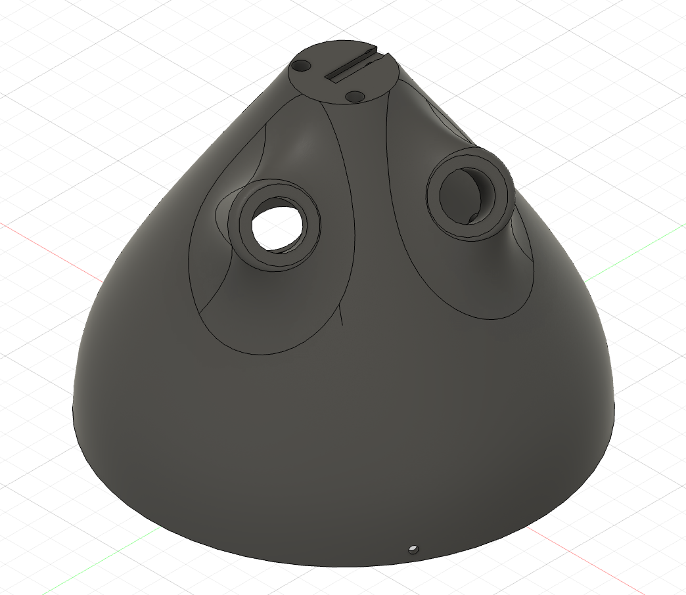
</div>

[Download STEP file](assets/hardware/printing/dome.step)

### Plate - PLA
<div align="center">

</div>

[Download STEP file](assets/hardware/printing/plate.step)

### Roller Cover - PLA (3x)
<div align="center">
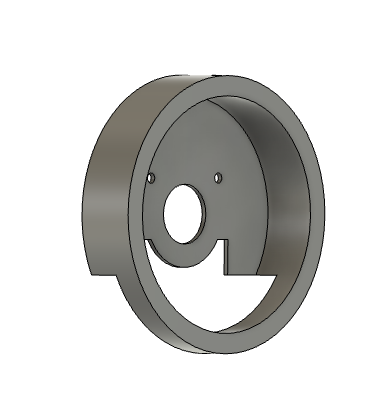
</div>

[Download STEP file](assets/hardware/printing/roller_cover.step)

### Roller - PLA (3x)
<div align="center">
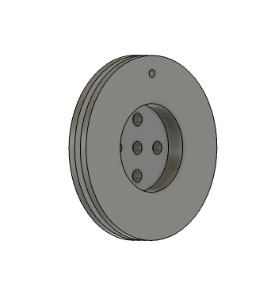
</div>

[Download STEP file](assets/hardware/printing/roller.step)

### Spike - PLA
<div align="center">
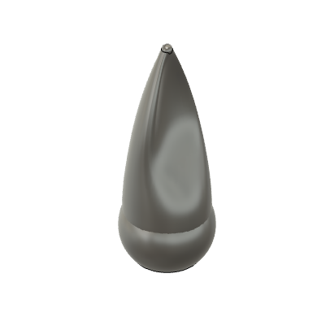
</div>

[Download STEP file](assets/hardware/printing/spike.step)

### Thick SpiRobs - eTPU
<div align="center">

</div>

[Download 3MF file](assets/hardware/printing/thick_spirobs.3mf) | [Download STEP file](assets/hardware/printing/thick_spirobs.step)

> **Note:** This is a modified version of the 3-cable SpiRobs with a thicker spine for increased rigidity and stability.

## Assembly Instructions

### Plate Preparation and Servo Driver Board Installation

Install 4x M2.5 heat set inserts at either of the driver board mounting locations on the plate using a soldering iron.

<div align="center">

</div>

Install 3x M2.5 heat set inserts at the dome fastener locations using a soldering iron.

<div align="center">
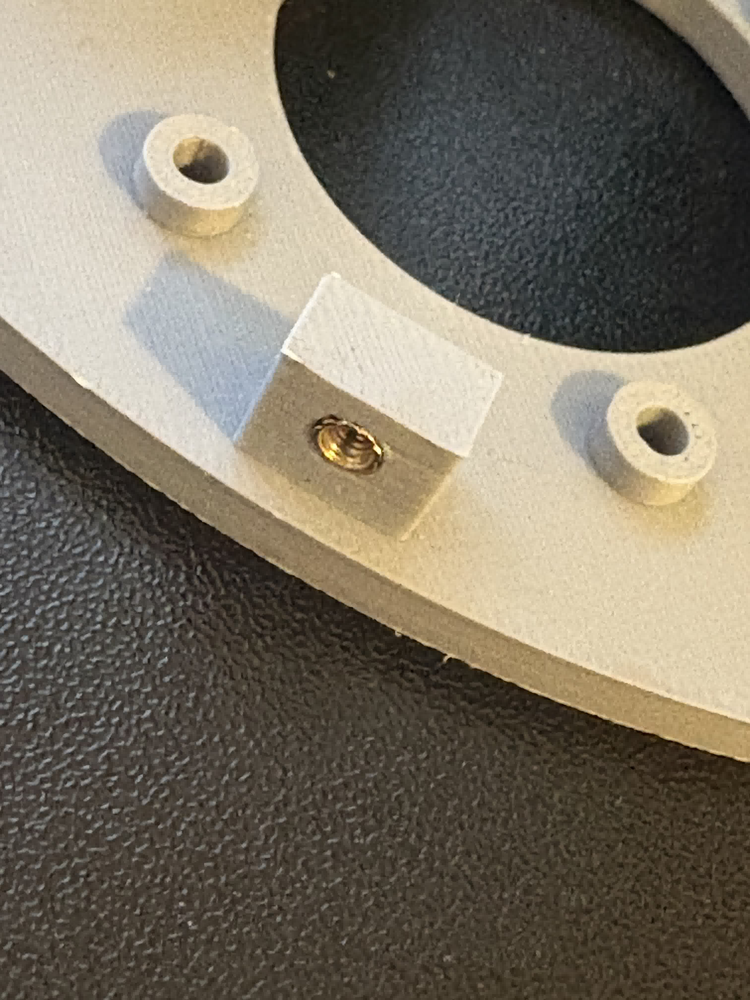
</div>

Mount the servo driver board to the plate using 2x M2.5 × 10mm screws (alternatively, use all four corner mounting holes). PCB standoffs can be used to elevate the driver board if desired.

<div align="center">

</div>

Secure the board to the plate at the previously installed insert locations.

<div align="center">

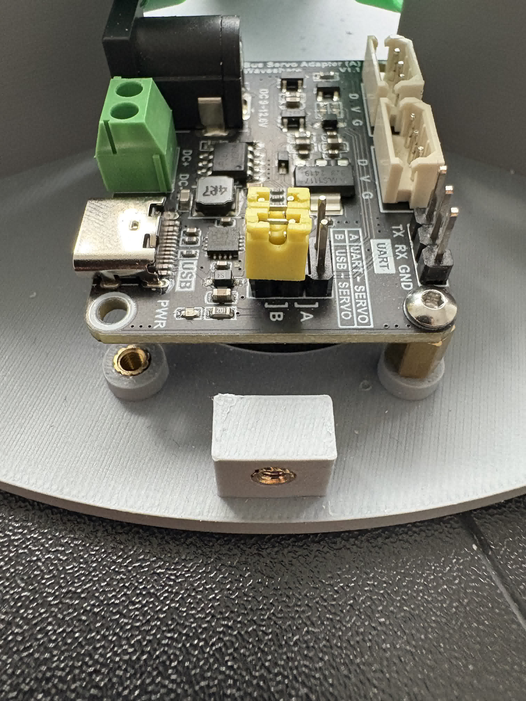
</div>

### Camera Mounting

Install 2x M2 heat set inserts at the camera fastener locations on the dome using a soldering iron.

<div align="center">
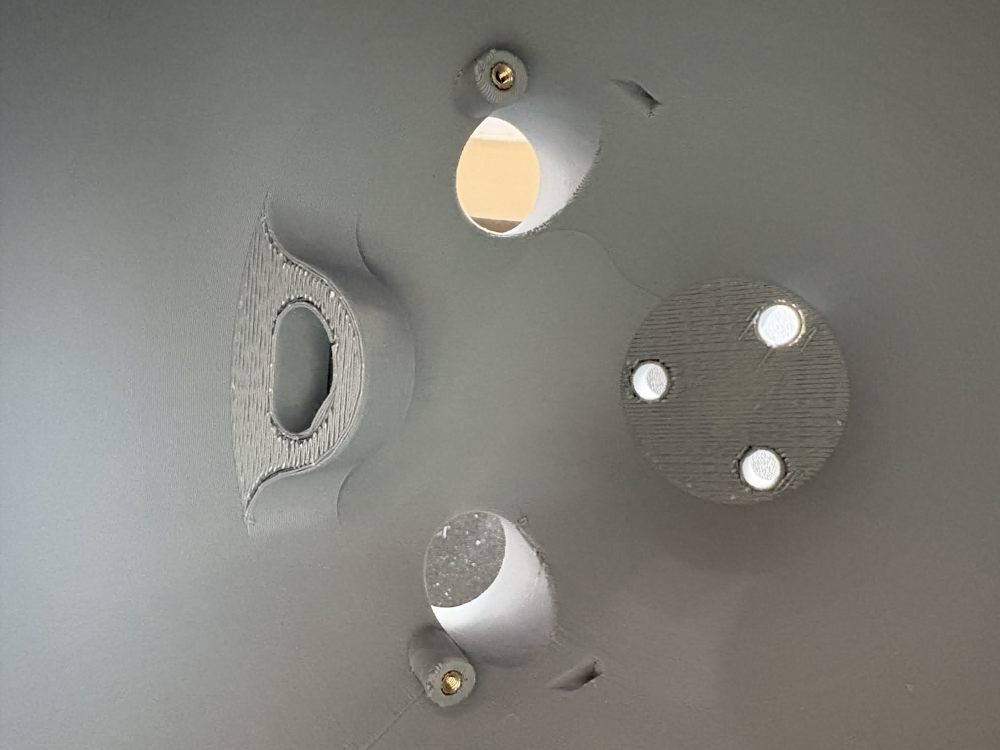
</div>

Position the camera in the mounting recesses within the dome and secure with 2x M2 × 6mm screws into the installed inserts.

<div align="center">
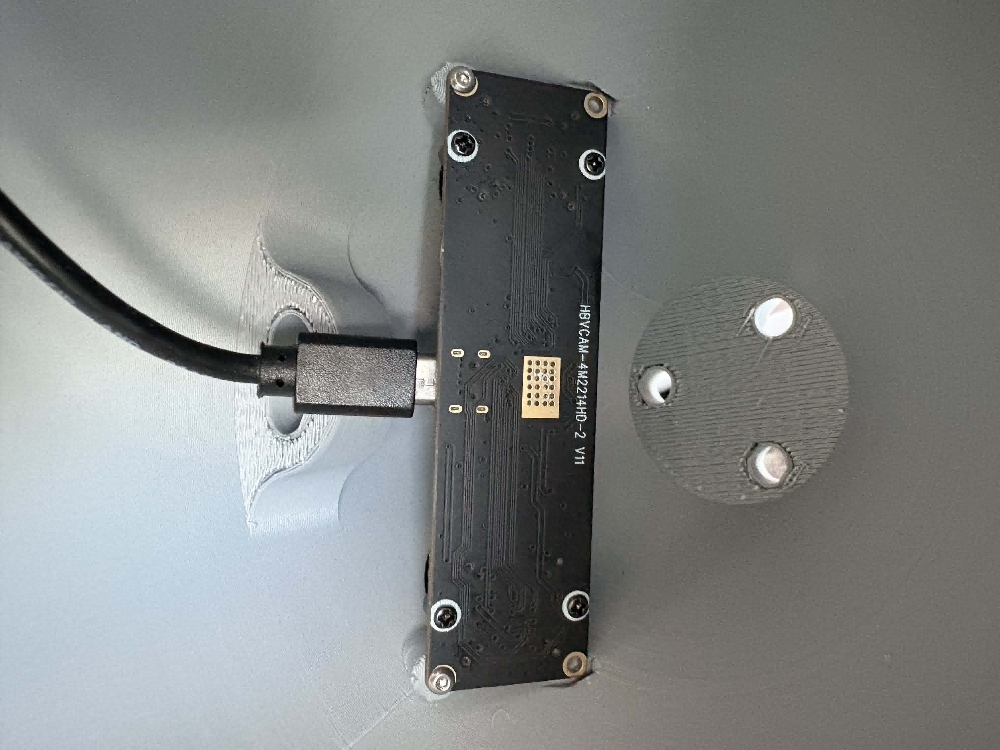
</div>

### Motor Assembly and Mounting

Remove the two top screws from each Waveshare motor and insert the motors into the roller covers.

<div align="center">
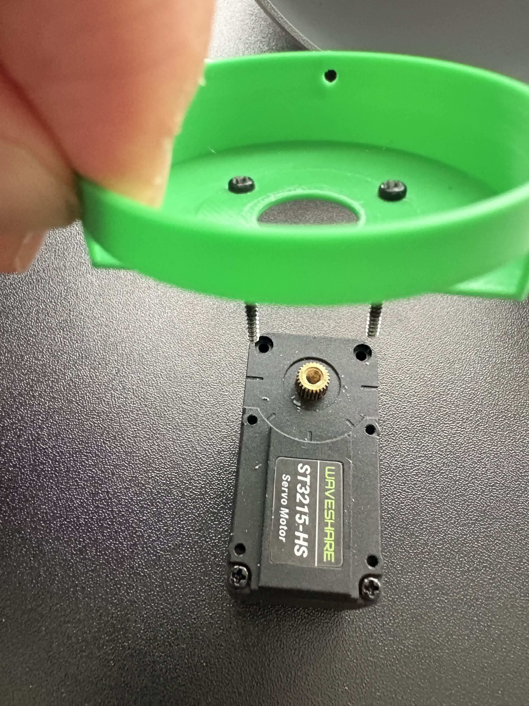
</div>

Reinstall the screws to secure the motors within the roller covers.

<div align="center">

</div>

Attach the rollers to each motor assembly.

<div align="center">

</div>

Repeat this procedure for the two other servo motors. Before proceeding, assign motor IDs according to the diagram below. Use stickers to identify each motor. For proper operation with the control software, each motor must be assigned the correct ID relative to the driver board position. The driver board should be positioned near the cable opening, opposite the camera where most operations will occur.

To assign motor IDs using the LeRobot codebase:

1. Connect each motor individually to the driver board
2. Connect the power cable to the driver board and USB-C cable to your computer
3. Find the USB port for the driver board:
```bash
git clone https://github.com/huggingface/lerobot.git
cd lerobot
python lerobot/scripts/find_motors_bus_port.py
```

4. Configure each motor ID (repeat for motors 1, 2, and 3):
```bash
python lerobot/scripts/configure_motor.py \
  --port DRIVER_BOARD_USB_PORT \
  --brand feetech \
  --model sts3215 \
  --baudrate 1000000 \
  --ID 1
```

Once configured, insert each motor into its designated slot on the plate.

<div align="center">
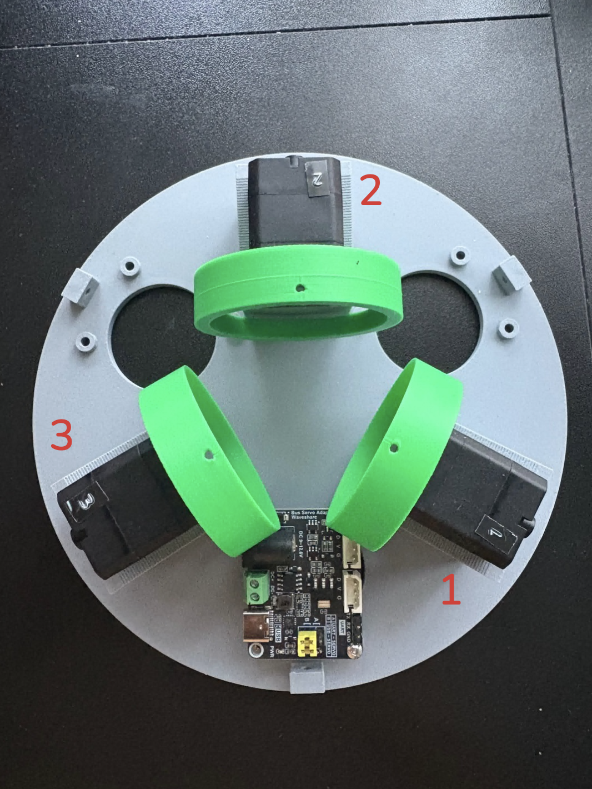
</div>

Secure the motors to the plate using the screws provided with the Waveshare motors (2 screws per motor recommended).

<div align="center">

</div>

The assembly should now appear as shown below.

<div align="center">
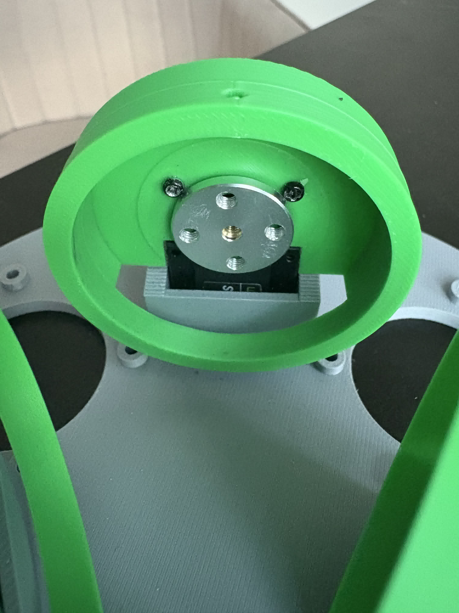
</div>

Install the fishing wire rollers. Begin by partially threading one screw into the roller to help with positioning on the wheel. A magnetic screwdriver is particularly useful for this step.

<div align="center">
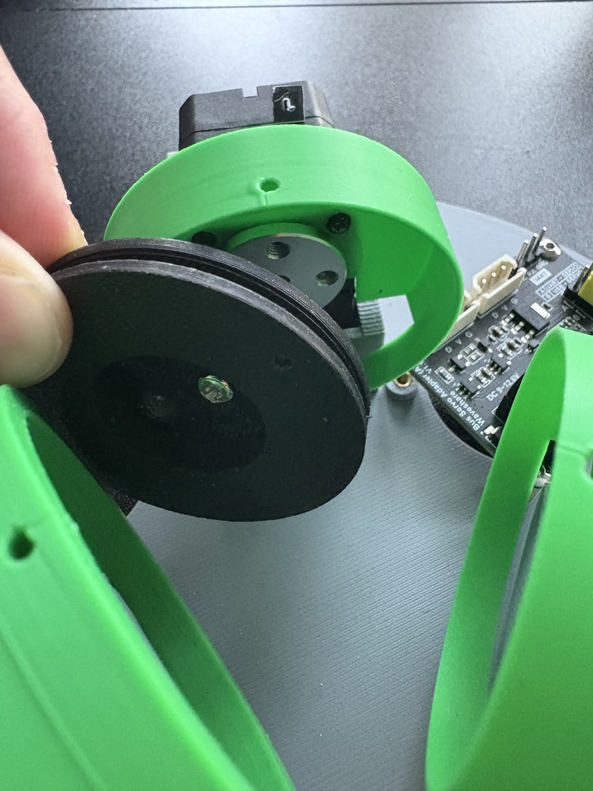
</div>

Fully secure the roller to the wheel.

<div align="center">

</div>

Ensure proper alignment:
- The remaining roller screw holes align with the wheel screw holes
- The fishing wire through-hole in the roller aligns with the through-hole in the roller cover

Use the screwdriver to rotate the motor/roller assembly as needed for proper alignment.

<div align="center">

</div>

Install the fishing wires (this is one of the most challenging step). Create a small bend at one end of each 80cm wire to facilitate insertion.

<div align="center">
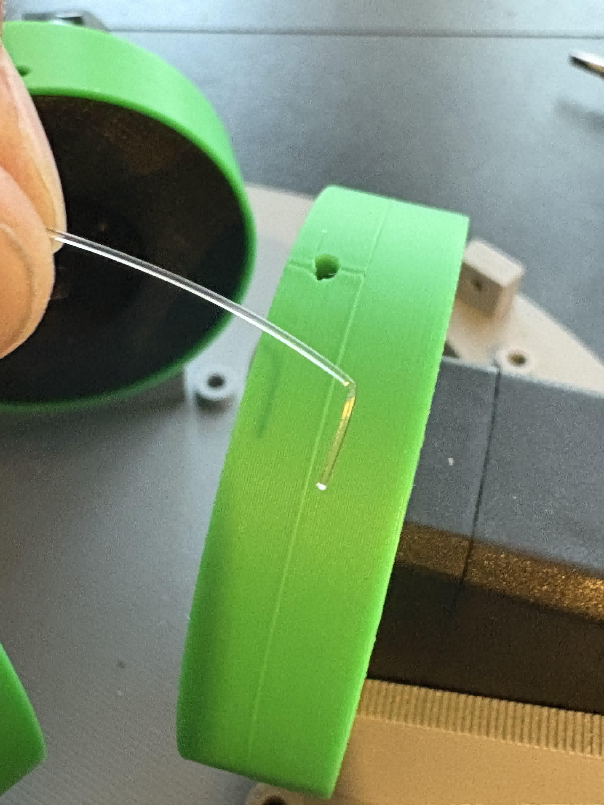
</div>

Thread the wire through both aligned holes.

<div align="center">

</div>

Bend the wire and insert it into the lower screw hole of the roller, opposite the already-installed screw.

<div align="center">

</div>

Install another Waveshare motor screw to secure the wire. Ensure the screw fully engages with the motor wheel threads.

<div align="center">
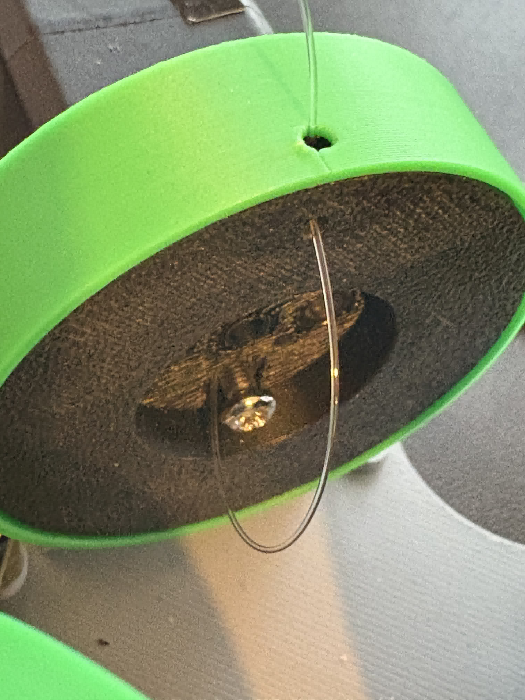
</div>

Test the wire security by pulling firmly. The wire should remain securely fastened. This method, while hacky, provides reliable wire retention.

<div align="center">

</div>

Repeat this procedure for the remaining two fishing wires and motors.

<div align="center">
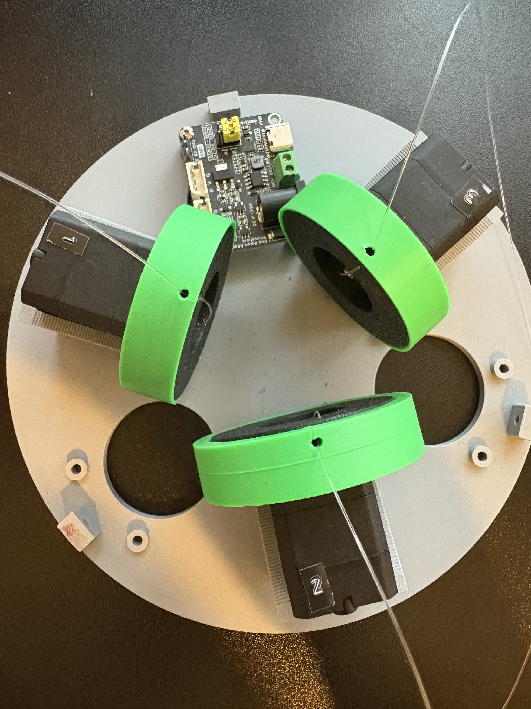
</div>

Connect the motors in sequence: Motor 2 to Motor 3, Motor 3 to Motor 1, and Motor 1 to the driver board.

<div align="center">

</div>

### Final Assembly

Begin final assembly by routing the three cables (camera, driver board data, and driver board power) through the dome opening. Connect the camera cable to the camera.

<div align="center">
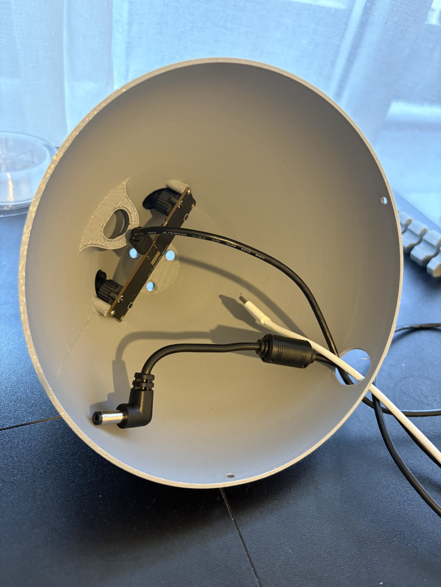
</div>

Connect the data and power cables to the driver board.

<div align="center">
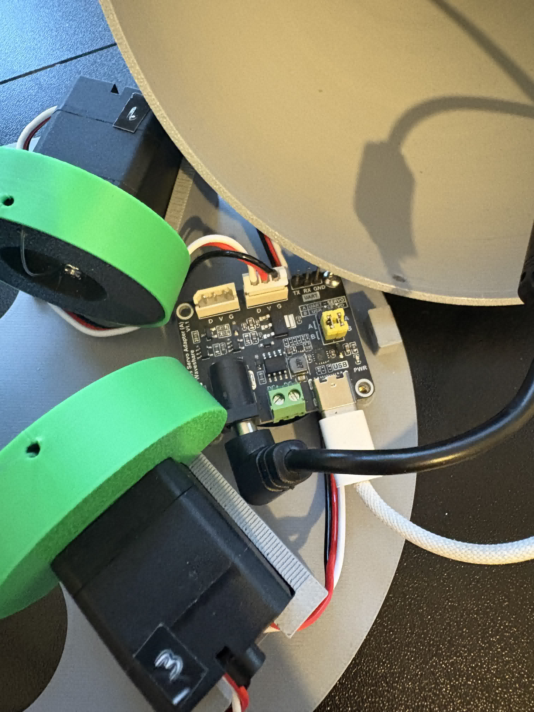
</div>

Thread each fishing wire through the corresponding holes in the dome top. Pay careful attention to the following:
- Wire 2 (front tendon actuator) must pass through the small tunnel to prevent camera interference when tensioned
- Each wire ID must correspond to the correct dome hole
- Route fishing wires beneath the camera cable to prevent interference during operation

Position the dome and pull the cables and fishing wires taut. Use the through-holes in the plate to verify proper cable routing from below.

<div align="center">

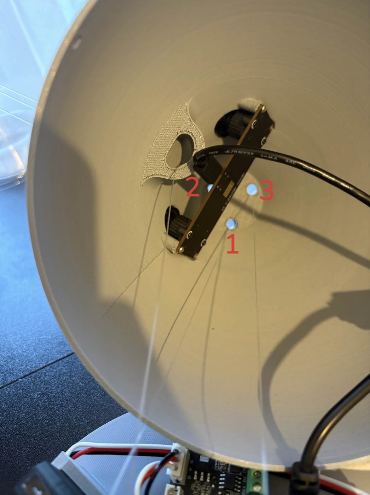
</div>
<div align="center">

</div>

Secure the dome with 3x M2.5 × 6mm screws.

<div align="center">

</div>

Thread the fishing wires through the tentacle. Ensure proper hole alignment as shown below, then feed each wire completely through all holes. Work with one wire at a time for best results.

<div align="center">

</div>

Once complete, pull all wires taut as shown.

<div align="center">

</div>

Before securing the wires with knots, remove excess slack using the calibration script. The 80cm wire length exceeds the resting length requirement for three important reasons:

1. **Control Range**: The software requires approximately one full rotation (≈11cm) of wire movement in each direction for proper tentacle articulation and slack management
2. **Maintenance Access**: Extra length allows dome inspection and internal work without untying knots and repeating the wire installation process
3. **Recalibration**: Provides adjustment capability for optimal rest position calibration

Run the calibration script for initial pre-rolling (we'll finetune the rest position later):

```bash
python -m shoggoth_mini calibrate --config shoggoth_mini/configs/default_hardware.yaml
```

Use the arrow keys (left, top, right) to wind the motors and remove slack. Press spacebar to reverse winding direction if needed. Note that the robot controllers expects you to roll them using the direction that comes at the start of the script. Do not change the rolling direction without doing the necessary software/config changes (I don't think it's configurable everywhere in the code yet).

Leave approximately 10cm of wire length for knot tying.

<div align="center">

</div>

For optimal wire securing, avoid direct knotting. Instead, create a loop with each wire and re-thread it through the final hole. This method provides better tension distribution and reduces the risk of loosening during operation. Pull each wire taut to eliminate slack. The tentacle should remain straight after this step.

<div align="center">
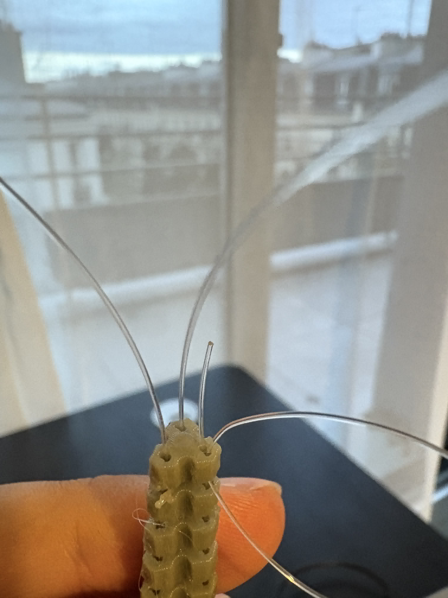
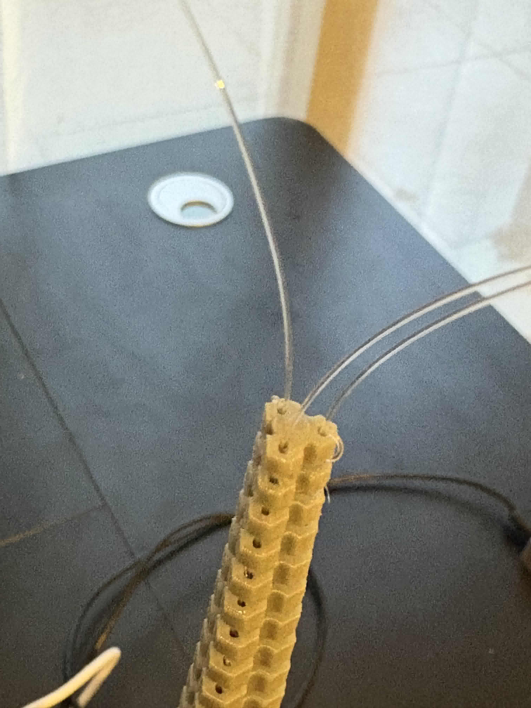
</div>

Tie a secure knot and pull firmly to test. Trim excess wire length, leaving at least 3cm for potential unknotting if needed.

<div align="center">
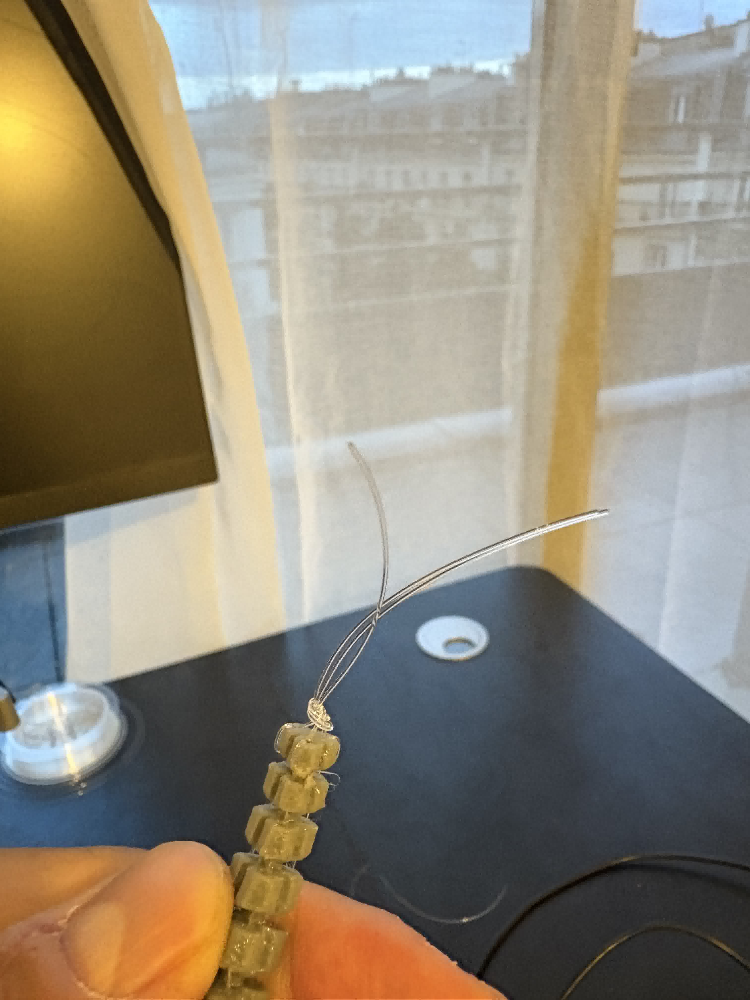
</div>

Tuck the remaining wire length into the spike tentacle tip and insert the spike into the first segment of the tentacle.

### Final Calibration

Perform the final tentacle calibration to ensure all wires are at their proper rest length. Run the calibration script and adjust using the arrow keys until the tentacle stands upright:

```bash
python -m shoggoth_mini calibrate --config shoggoth_mini/configs/default_hardware.yaml
```

This script saves calibration data to `assets/hardware/calibration/tentacle_calibration.json`, which will be automatically loaded by the control software later.

**Important calibration notes:**
- Avoid excessive wire unwinding during calibration (unless the dome is also being pulled away to maintain tension)
- Prevent over-tightening of cables (see comparison images below)

<table align="center">
<tr>
<td align="center">

<br>
<em>Proper cable tension</em>
</td>
<td align="center">
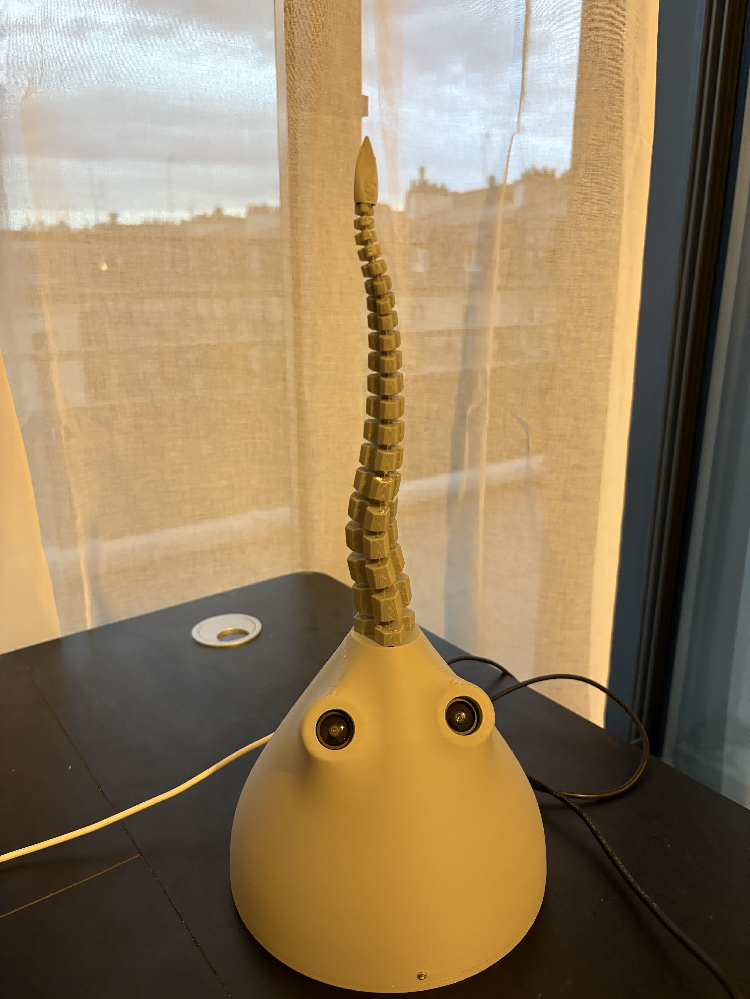
<br>
<em>Over-tensioned - avoid this</em>
</td>
</tr>
</table>

A properly calibrated tentacle tip should exhibit "chicken head" behavior: remaining relatively stable as you twist and bend the tentacle body.

<div align="center">

</div>

Done!